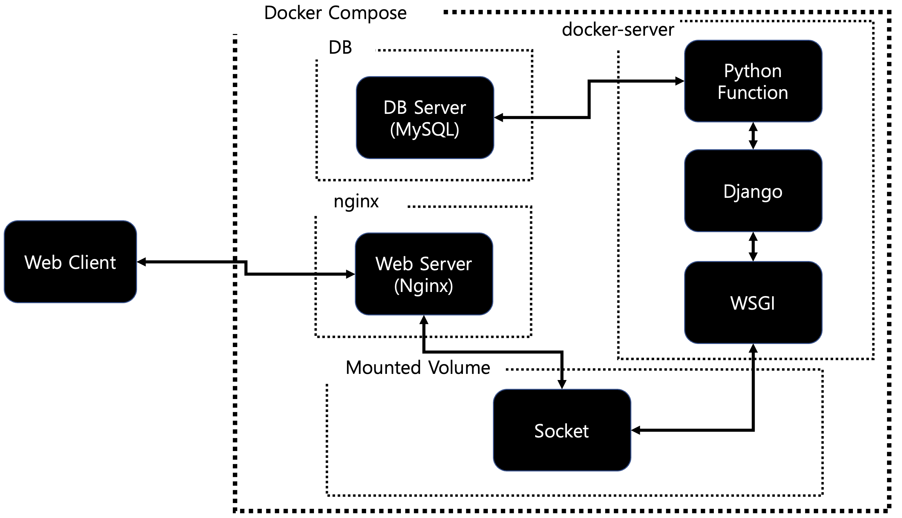

# Django Login API
This project only use django's native authentication. I'm planning to add the OAuth2.0 authentication and JWT authorization methods.

## Architecture

> In the actual server, the database must be separated into another (computer) machine. This is because it is vulnerable to security.
